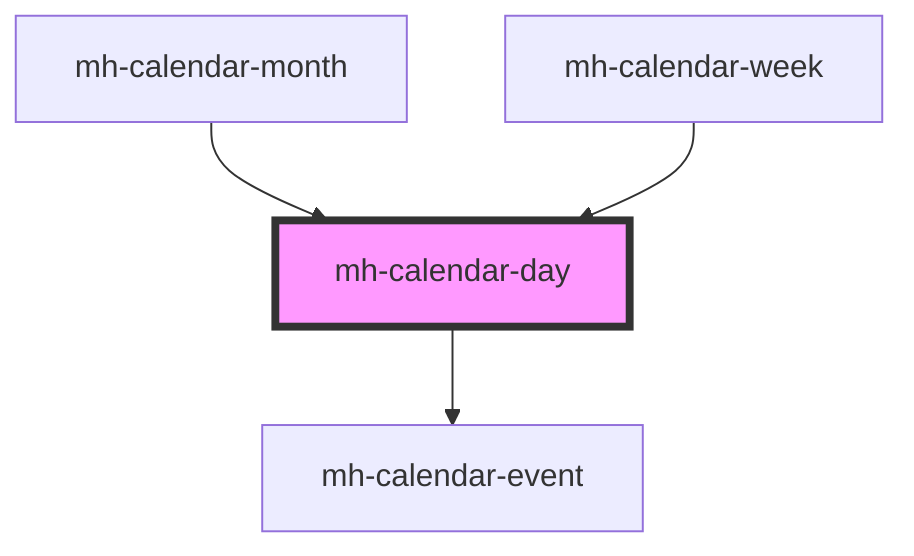

# mh-calendar-day

<!-- Auto Generated Below -->

## Properties

| Property          | Attribute           | Description | Type                 | Default            |
| ----------------- | ------------------- | ----------- | -------------------- | ------------------ |
| `day`             | `day`               |             | `Date`               | `undefined`        |
| `events`          | `events`            |             | `MHCalendarEvents[]` | `[]`               |
| `showCurrentDate` | `show-current-date` |             | `boolean`            | `SHOW_DATE_ON_DAY` |

## Dependencies

### Used by

- [mh-calendar-month](../mh-calendar-month)
- [mh-calendar-week](../mh-calendar-week)

### Depends on

- [mh-calendar-event](../mh-calendar-event)

### Graph

---

_Built with [StencilJS](https://stenciljs.com/)_
