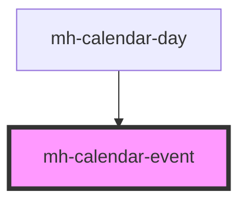

# mh-calendar-event

<!-- Auto Generated Below -->

## Properties

| Property           | Attribute            | Description | Type                                                                                                                            | Default     |
| ------------------ | -------------------- | ----------- | ------------------------------------------------------------------------------------------------------------------------------- | ----------- |
| `dayHeight`        | `day-height`         |             | `number`                                                                                                                        | `undefined` |
| `dayOfRendering`   | `day-of-rendering`   |             | `Date`                                                                                                                          | `undefined` |
| `event`            | `event`              |             | `{ id: string; title?: string; startDate?: Date; endDate?: Date; allDay?: boolean; description?: string; isHidden?: boolean; }` | `undefined` |
| `eventTopPosition` | `event-top-position` |             | `number`                                                                                                                        | `undefined` |
| `isDragged`        | `is-dragged`         |             | `boolean`                                                                                                                       | `false`     |

## Dependencies

### Used by

- [mh-calendar-day](../mh-calendar-day)

### Graph

---

_Built with [StencilJS](https://stenciljs.com/)_
