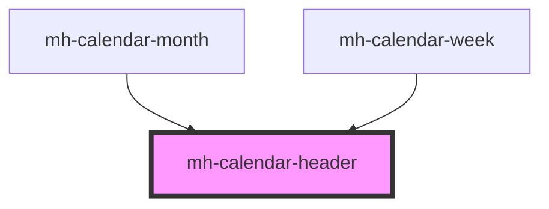

# mh-calendar-header

<!-- Auto Generated Below -->

## Properties

| Property          | Attribute           | Description | Type      | Default |
| ----------------- | ------------------- | ----------- | --------- | ------- |
| `showCurrentDate` | `show-current-date` |             | `boolean` | `false` |

## Dependencies

### Used by

- [mh-calendar-month](../mh-calendar-month)
- [mh-calendar-week](../mh-calendar-week)

### Graph

---

_Built with [StencilJS](https://stenciljs.com/)_
