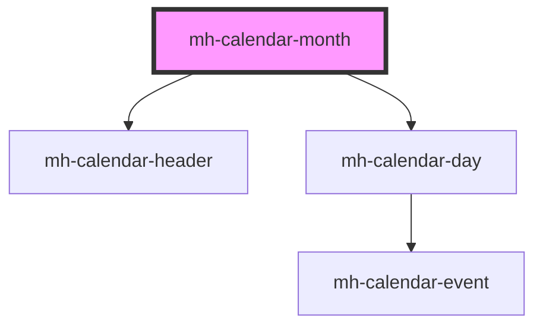

# mh-calendar-month

<!-- Auto Generated Below -->

## Dependencies

### Depends on

- [mh-calendar-header](../mh-calendar-header)
- [mh-calendar-day](../mh-calendar-day)

### Graph

---

_Built with [StencilJS](https://stenciljs.com/)_
