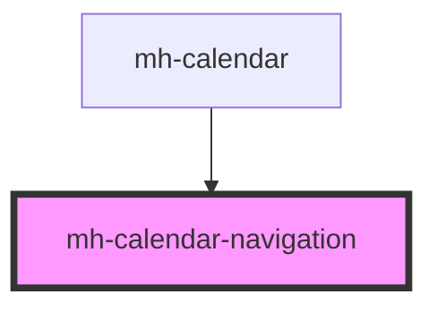

# mh-calendar-navigation

<!-- Auto Generated Below -->

## Properties

| Property                | Attribute                   | Description | Type                                   | Default                   |
| ----------------------- | --------------------------- | ----------- | -------------------------------------- | ------------------------- |
| `changeDateRangeByUnit` | `change-date-range-by-unit` |             | `"day" \| "month" \| "week" \| number` | `DEFAULT_NAVIGATION_UNIT` |

## Dependencies

### Used by

- [mh-calendar](../mh-calendar)

### Graph

---

_Built with [StencilJS](https://stenciljs.com/)_
