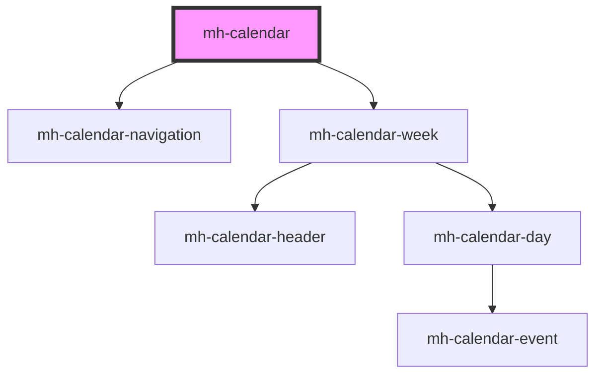

# mh-calendar

<!-- Auto Generated Below -->

## Properties

| Property | Attribute | Description | Type                 | Default       |
| -------- | --------- | ----------- | -------------------- | ------------- |
| `events` | `events`  |             | `MHCalendarEvents[]` | `MOCK_EVENTS` |

## Dependencies

### Depends on

- [mh-calendar-navigation](../mh-calendar-navigation)
- [mh-calendar-week](../mh-calendar-week)

### Graph

---

_Built with [StencilJS](https://stenciljs.com/)_
